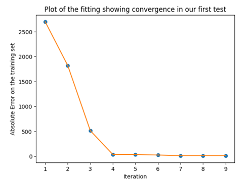
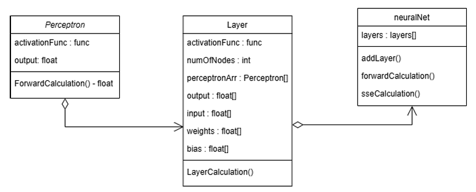
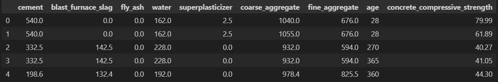

## Artificial Neural Network (ANN) optimised using Particle Swarm Optimisation (PSO)
- An ANN is built with parameters optimised using PSO algorithms.
- The model predicted the strength of concrete with the given numeric dataset, obtaining an error measurement of 13.67 with sd of 2.523.
- Below shows the convergence of error measurement for each iteration of PSO algorithm. \

# Design of the ANN
- Activation function applied: Logistic, Hyperbolic and ReLU\

# Sample of dataset

